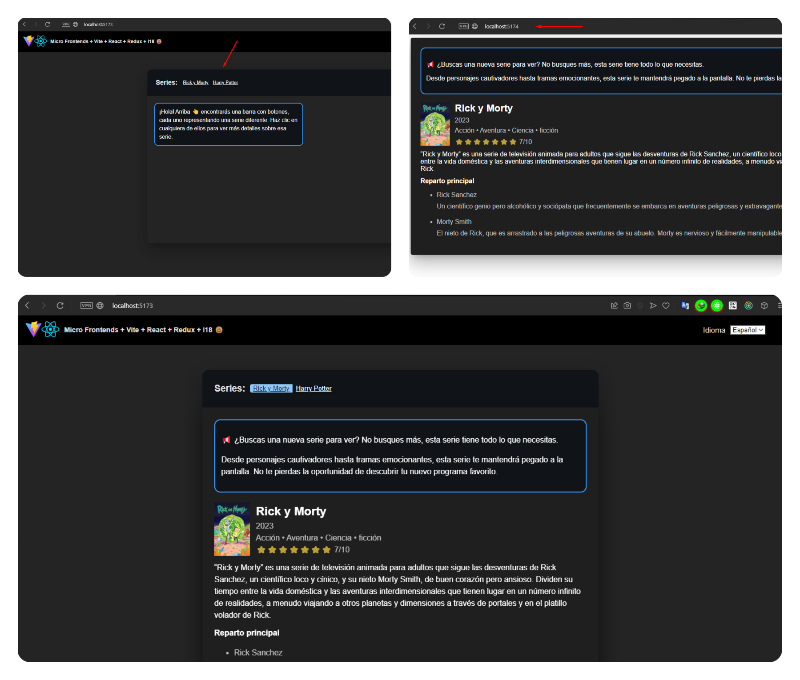

# MultiLingual MicroFrontends con Vite, React y Redux

**Compartiendo Estados y Eventos entre Módulos MFE**



Este es un proyecto sencillo que demuestra la integración de microfrontends utilizando Vite Module Federation con React. Permite cambiar el idioma de forma global, emitiendo un evento desde el host que es escuchado por los demás microfrontends para mantener el idioma sincronizado.

Cada proyecto tiene independencia completa, con su propio sistema de estado con Redux y lógica aislada.

El proyecto Host proporciona la interfaz principal, con la capacidad de cargar bajo demanda cada microfrontend dentro de la UI y pasarles props.

Se implementó internacionalización utilizando i18next, con carga dinámica de traducciones. Los idiomas son agregados dinámicamente por los componentes, Los componentes se estructuran en módulos independientes y cargan dinámica de traducciones como los estilos.

Todo esto contribuye a la escalabilidad y mantenibilidad del proyecto.

Para los estilos se aplicó Styled Components con la metodología BEM para mantener consistencia.

### **¿Que es Module Federation?**

Module Federation es una característica de webpack 5 que permite a múltiples aplicaciones JavaScript independientes trabajar juntas. La idea es que diferentes equipos puedan trabajar en sus propias aplicaciones, pero estas aplicaciones pueden compartir componentes. Esto puede ser útil para microfrontends, donde diferentes equipos pueden trabajar en diferentes partes de una aplicación más grande.

### **¿Que es Vite Plugin Federation?**

Vite Plugin Federation es un plugin que añade soporte para Module Federation a Vite. Esto significa que puedes usar Vite para construir tus aplicaciones y aún así beneficiarte de las características de Module Federation.

Pueden obtener más información sobre Vite Plugin Federation en su [repositorio de GitHub](https://originjs.org/en/guide/plugins/vite-plugin-federation/)
y en su [documentación oficial](https://github.com/originjs/vite-plugin-federation)

¡Espero que esto les ayude!

---

### **La estructura de los componentes locales de cada proyecto es la siguiente:**

```
📁 components
└── 📁 Component
    ├── 📁 lang
    │       🌐 en.json
    │       🌐 es.json
    │       📄 index.js
    │
    ├── 📁 styles
    │       🎨 componentStyles.js
    │
    └──   📄 index.js
          📄 Component.jsx
```

### **Tecnologías utilizadas**

Este proyecto fue desarrollado utilizando las siguientes tecnologías y herramientas: React, Redux, React-Redux, redux-thunk, i18next, react-i18next, Styled Components, vite-plugin-federation, Vite.

### **Requisitos del sistema**

Este proyecto fue desarrollado con las siguientes versiones de Node.js y npm:

- Node.js: v18.17.1
- npm: 10.2.4

Por favor, asegúrate de tener instaladas estas versiones (o versiones más recientes) antes de intentar instalar y ejecutar este proyecto.

### **Proyectos Relacionados**

Este proyecto host se integra con dos proyectos remotos que contienen los componentes de las series. Estos son:

- **Proyecto Remoto 1:** Este proyecto contiene los componentes de una de las series que se muestran en la aplicación host [https://github.com/dennysjmarquez/MultiLingual-MicroFrontends-vite-react-redux-Remote1](https://github.com/dennysjmarquez/MultiLingual-MicroFrontends-vite-react-redux-Remote1)
- **Proyecto Remoto 2:** Este proyecto contiene los componentes de la otra serie que se muestra en la aplicación host [https://github.com/dennysjmarquez/MultiLingual-MicroFrontends-vite-react-redux-Remote2](https://github.com/dennysjmarquez/MultiLingual-MicroFrontends-vite-react-redux-Remote2)

Ambos proyectos remotos son fundamentales para la funcionalidad de la aplicación host, ya que proporcionan los datos y la interfaz de usuario para las series que se muestran.

### **Instalación**

Para ejecutar el proyecto principal o host y los proyectos remotos en tu entorno local, necesitarás seguir estos pasos:

1. **Clonar los repositorios:** Primero, necesitarás clonar los repositorios de los proyectos en tu máquina local.
2. **Instalar las dependencias:** En cada proyecto, posiciónese en la raíz del directorio y ejecute el comando `yarn` para instalar las dependencias.

### **Cómo usar la aplicación**

1. **Inicia los proyectos remotos:** Asegúrate de que los proyectos remotos estén en ejecución. Puedes hacer esto ejecutando el comando `yarn build && yarn preview` o `yarn start` en el directorio de cada proyecto remoto. 
Deberían estar accesibles en `http://localhost:5174` y `http://localhost:5175`.
2. **Inicia el proyecto host:** Antes de iniciar el proyecto host, es una buena práctica verificar que los proyectos remotos estén en ejecución y sean accesibles. Puedes hacer esto simplemente navegando a cada una de sus URL.
Si sigues estos pasos, deberías poder ver y interactuar con tu aplicación completa en tu navegador web.

Recuerden que el proyecto host se integra con los proyectos remotos, por lo que necesitarás tener los proyectos remotos en ejecución para que el proyecto host funcione correctamente.

### **Integración con Microfrontends**

La configuración de Federation se define en `vite.config.js`

### **Proyecto Host**

```js
// Federation Plugin
federation({
  name: 'host',
  remotes: {
    remoteMovieList1: 'http://localhost:3000/remoteEntry.js', 
    remoteMovieList2: 'http://localhost:3001/remoteEntry.js'
  } 
})
```
- `remotes`: Define los microfrontends remotos con sus rutas específicas.
- `shared`: Define los módulos que serán compartidos entre el host y los microfrontends remotos. Al marcar un módulo como compartido, estás indicando que tanto el host como los microfrontends remotos deben utilizar la misma instancia de ese módulo.


La opción `shared` se utiliza para definir los módulos que serán compartidos entre el host y los remotos. En este caso, se comparten los módulos 'react', 'react-dom' y 'react-redux'.

Esto significa que tanto el host como los remotos utilizarán la misma instancia de estos módulos. Esto es beneficioso por varias razones:

1. **Optimización del rendimiento**: Al compartir módulos entre el host y los remotos, se evita la necesidad de cargar la misma biblioteca varias veces. Esto puede resultar en una disminución significativa del tiempo de carga y del uso de la memoria.
    
2. **Consistencia**: Al utilizar la misma instancia de un módulo en todo el proyecto, se garantiza que todos los componentes se comporten de la misma manera, ya que todos utilizan exactamente la misma versión del módulo.

3. **Interoperabilidad**: Al compartir módulos, se facilita la comunicación y la interoperabilidad entre el host y los remotos. Esto es especialmente útil cuando se utilizan bibliotecas de gestión de estado como 'react-redux', ya que permite que el estado se gestione de manera coherente en todo el proyecto.

Es importante que la lista de módulos compartidos en la configuración de la Federación del host coincida con la de los remotos para que la compartición de módulos funcione correctamente.

### **Proyectos Remotos**

Cada microfrontend remoto expone componentes en su propio `remoteEntry.js`

**RemoteMovieList1:**

```js
federation({
	// Configura el plugin de Module Federation.
	name: 'remoteMovieList1', // Define el nombre del remoto.
	filename: 'remoteEntry.js', // Define el nombre del archivo de entrada remoto.
	exposes: {
		// Define los módulos que se exponen.
		'./MovieList': './src/components/MovieList'
	},
	shared: ['react', 'react-dom', 'react-redux'] // Define los módulos compartidos.
})
```

**RemoteMovieList2:**

```js
federation({
	// Configura el plugin de Module Federation.
	name: 'remoteMovieList2', // Define el nombre del remoto.
	filename: 'remoteEntry.js', // Define el nombre del archivo de entrada remoto.
	exposes: {
		// Define los módulos que se exponen.
		'./MovieList': './src/components/MovieList'
	},
	shared: ['react', 'react-dom', 'react-redux'] // Define los módulos compartidos.
})
```

### **Consumo en el Host**

El componente `Series.jsx` del host consume los remotos

```js
// Carga de módulos de micro-frontends
const MovieList = React.lazy(() =>
	import('remoteMovieList1/MovieList').catch(() => ({ default: () => null }))
)
const MovieList2 = React.lazy(() =>
	import('remoteMovieList2/MovieList').catch(() => ({ default: () => null }))
)
```

En el host, estás consumiendo estos componentes remotos en el componente Series.jsx utilizando React.lazy() para importarlos.

Además, se está manejando los errores de importación con .catch(() => ({ default: () => null })) para asegurar de que la aplicación no se rompa si hay algún problema al importar los componentes remotos.

De esta forma, el proyecto host se integra con los microfrontends remotos a través de Federation.

Es importante que los nombres y la configuración de los remotos coincidan con los del host para que todo funcione correctamente. 

En este caso, tanto el host como los remotos están configurados para exponer/importar el componente `MovieList`.

====

¡Espero que esto les ayude a utilizar la aplicación! 🤝👍


-- END --


